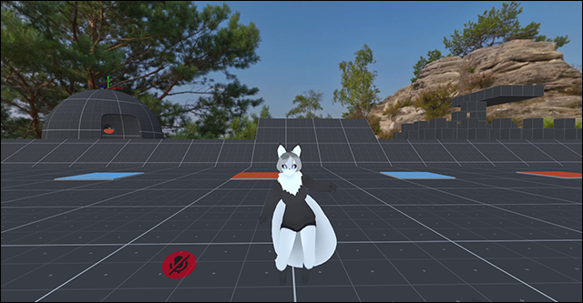

# Kinect Tracking Extension
MelonLoader mod for VRChat that brings Kinect tracking.  
Supports Kinect for XBox One / Kinect 2 for Windows and Kinect for XBox 360.

# Installation
* Install [latest MelonLoader](https://github.com/LavaGang/MelonLoader)
* Install [latest VRChatUtilityKit](https://github.com/SleepyVRC/Mods)
* **Optional:** Install [latest UIExpansionKit](https://github.com/knah/VRCMods)
* Get [latest release DLL](../../../releases/latest):
  * Put `ml_kte.dll` in `Mods` folder of game

# Usage
## Settings 
Available mod's settings through UIExpansionKit:
* **Enable Kinect tracking:** enabled tracking from Kinect's data, overrides avatar IK even if no data is provided, disabled by default.
* **Kinect version:** Kinect version for skeleton data, `1` is Kinect for XBox 360, `2` is Kinect for XBox One / Kinect 2 for Windows; `1` by default.
* **Root position X/Y/Z:** Right/up/forward root position offset, zero by default.
* **Root rotation X/Y/Z:** root rotation offset, zero by default.
* **Show tracking points:** show spheres on tracking points from Kinect's skeleton data, disabled by default.
* **Head/Hips/Legs/Hands tracking:** enable position for specific body part from Kinect's skeleton data, enabled by default.
* **Head/Hips/Legs/Hands rotation:** apply rotation for specific body part from Kinect's skeleton data (if rotation is present), enabled by default.

# Notes
* Avatars that have unproportional skeleton to your real life skeleton can be visually distorted (flipped hips, bent legs). Solution is in progress. 
* Designed for desktop usage, can't be used for VR because of recent changes in VRChat's internal tracking hierarchy. Instead use SteamVR drivers that emulate trackers based on data from Kinect.
