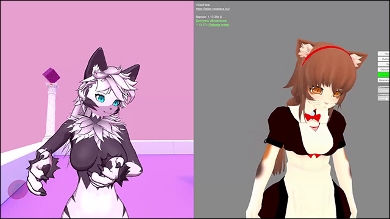

# VSeeFace Extension
MelonLoader mod for VRChat that retrieves head tracking from VSeeFace and applies it to avatar.

# Installation
* Install [latest MelonLoader](https://github.com/LavaGang/MelonLoader) for VRChat and VSeeFace
* Install [latest VRChatUtilityKit](https://github.com/SleepyVRC/Mods) for VRChat
* Install [latest UIExpansionKit](https://github.com/knah/VRCMods) for VRChat
* Get [latest release DLLs](../../../releases/latest):
  * Put `ml_vsf.dll` in `Mods` folder located in VRChat's folder
  * Put `ml_vsf_wrapper.dll` in `Mods` folder located in VSeeFace's folder

# Usage
## Settings 
Available mod's settings through UIExpansionKit:
* **Enable VSF tracking:** enabled tracking from VSeeFace data, disabled by default.
* **Linear smoothing:** movement smoothing, `0.5` by default.
* **Tracking mirroring:** movement mirroring, similar to mirroring option in VSeeFace, disabled by default.
## Tracking
* After first tracking enabling you have to calibrate head height by clicking on `VSF height reset` button in main UIExpansionKit quick menu tab.
  * If you change avatar in VSeeFace, you have to calibrate head height again.

# Notes
* Designed for desktop usage, can't be used for VR because of VRChat's internal tracking hierarchy.
* If [IKTweaks](https://github.com/knah/VRCMods) is used, disable `Don't freeze head/hands inside walls` option.
* Current mod won't be added to VRCMG list due to security rules for mods that consist of separated parts.
